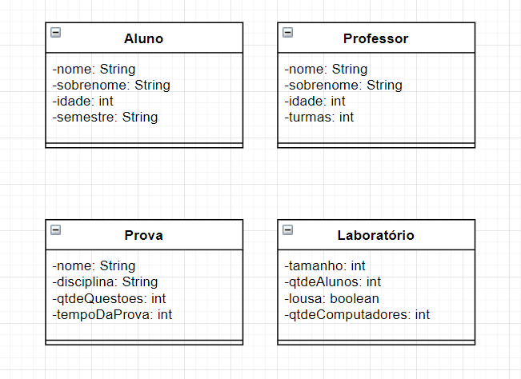

# Atividade 02

**Instruções**
Criar no diagrama de classe as seguintes classes (observação: defina pelo menos 4 atributos para cada classe)
-Aluno
-Professor
-Laboratorio
-Prova
Criar as classes utilizando o site [draw.io](http://draw.io/).

