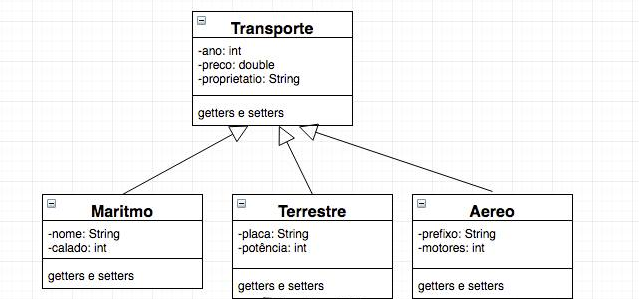
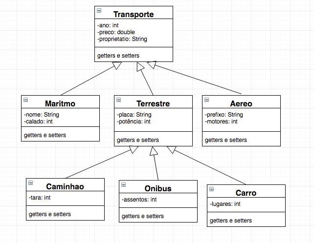

# Tarefa 03 para aula 03

**Instruções**
Explicar o que é herança e quais suas vantagens para o desenvolvedor. Dê 2 exemplos.

### Herança
Criar uma classe apartir de uma já existente, herdando seus atributos e métodos, ou seja, uma subclasse. Isso facilitaao criar uma nova classe que tenha os mesmos atributos e métodos de uma jáe xistente, além de também poder criar seus próprios atributos e métodos.

**Exemplos:**
Podemos ter uma classe chamada transporte, e outras 3 subclasses terrestre, maritmo e aéreo, que herdam todos os atributos e métodos de transporte.

Também podemos ter mais subclasses herdando de terrestre por exemplo:
