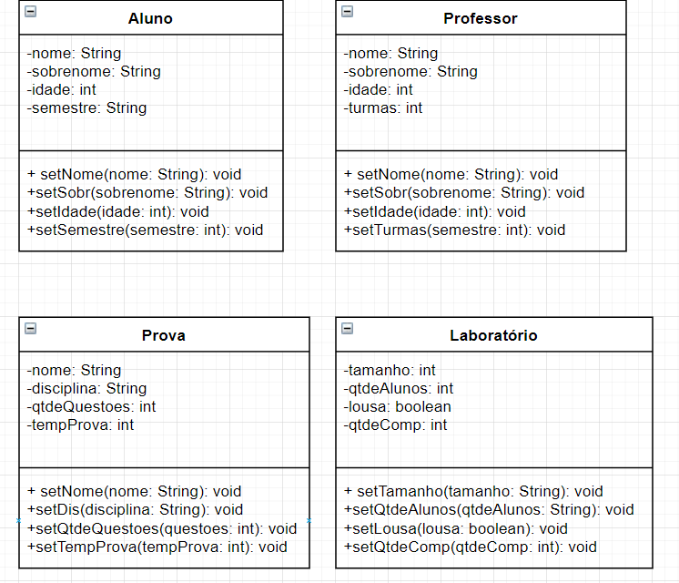

# Tarefa 01 para aula 02

**Instruções**

1. O que significa o conceito de encapsulamento?
2. O que significa visibilidade do atributo?
3. Criar no draw.io 4 classes java quaisquer com 4 atributos e colocar os métodos setters
4. Como é um método getter? De exemplo...

**Meu trabalho:**

### Encapsulamento

"Objetos do mundo real encapsulam em si os próprios atributos, quer sejam descritivos, partes componentes ou funções.” (Meyer, 1997). Basicamente é você não expor diretamente os atributos quando for fazer algum tipo de manipulação, por isso utilizamos os métodos getters e setters.

### Visibilidade do atributo

* Privado: quando o atributo não é visível a nenhuma classe externa;
* Público: Visível internamente e para outras classes e elementos externos;
* Protegida: não visível a classes e elementos externos, apenas internamento e para seus herdeiros.

### Método get

O método getter retorna uma informação de um atributo. Por exemplo:
getIdade(): int
Considerando que temos uma classe chamada Aluno, com um atributo idade do tipo inteiro, usamos o método getIdade para retornar o valor deste atributo.

Fontes: <https://www.ic.unicamp.br/~santanch/teaching/oop/2015-1/slides/poo0205-encapsulamento-sobrecarga-v06.pdf>

