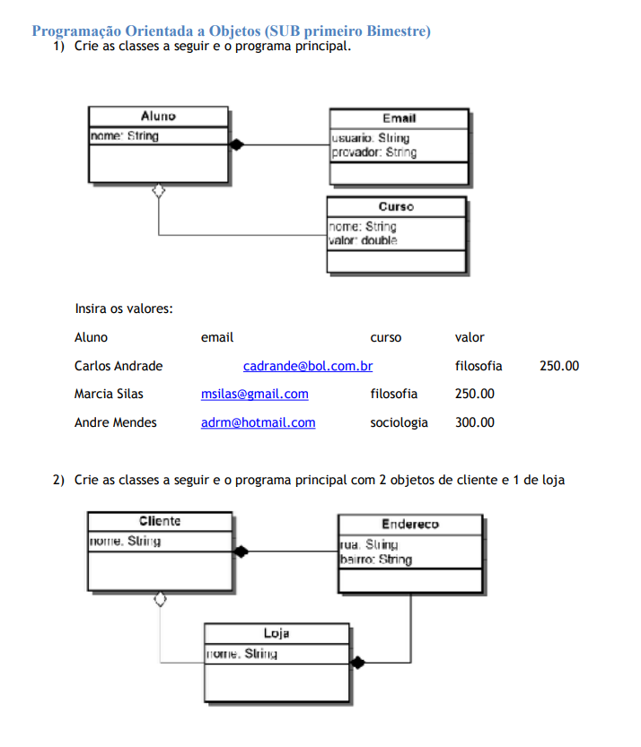
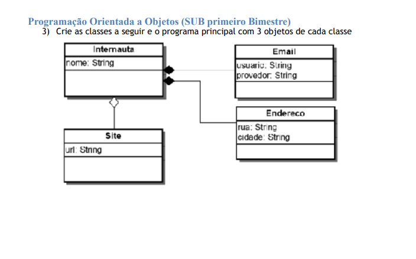

# Tarefa 01 para aula 06

**Instruções**

1. Crie projetos com seu NOME para cada exercício da lista a seguir
2. Crie em java os elementos dos diagramas.
Observação: prova sub de uma turma do passado que hoje está ativa no mercado de trabalho.

